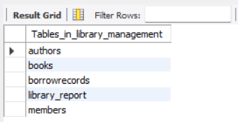
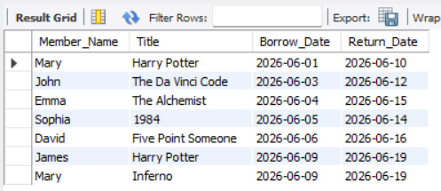
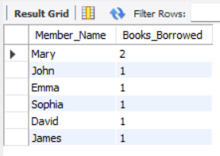
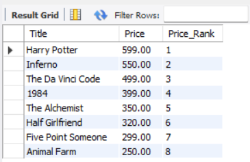
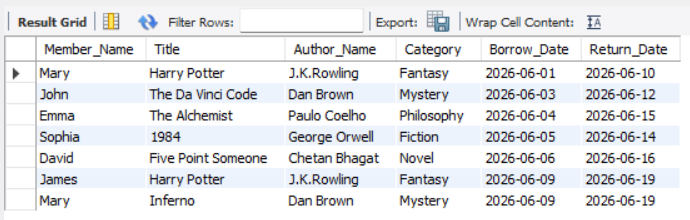
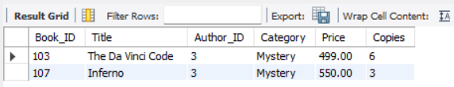

# 📚 Library Management System using MySQL

A comprehensive relational database project developed using **MySQL** to manage library operations such as book inventory, author information, member records, and borrowing transactions.

This project demonstrates database design, relational modeling, SQL programming, business reporting, and advanced SQL concepts including **CRUD Operations, JOINs, Aggregate Functions, Views, Stored Procedures, Window Functions, and Subqueries**.

---

## 📌 Table of Contents

- [Project Overview](#-project-overview)
- [Features](#-features)
- [Technologies Used](#-technologies-used)
- [Project Structure](#-project-structure)
- [Database Schema](#-database-schema)
- [SQL Skills Demonstrated](#-sql-skills-demonstrated)
- [Project Screenshots](#-project-screenshots)
- [How to Run](#-how-to-run)
- [Project Highlights](#-project-highlights)
- [Future Enhancements](#-future-enhancements)
- [Author](#-author)

---

# 📖 Project Overview

The Library Management System simulates the operations of a real-world library using a relational database.

It maintains information about:

- Authors
- Books
- Members
- Borrow Records

The database is designed using normalization principles and relationships enforced through **Primary Keys** and **Foreign Keys**.

---

# ✨ Features

- 📚 Manage books and authors
- 👤 Maintain library member records
- 🔄 Track borrowing transactions
- ➕ Perform CRUD operations
- 🔗 Execute JOIN queries
- 📊 Generate analytical reports
- 📈 Apply Window Functions
- 🛠 Create Views and Stored Procedures

---

# 🛠 Technologies Used

- MySQL 8.0
- MySQL Workbench
- SQL
- Relational Database Design

---

# 📂 Project Structure

```text
Library-Management-System-SQL/
│
├── README.md
├── LICENSE
├── database_diagram.png
├── schema.sql
├── sample_data.sql
├── crud_operations.sql
├── join_queries.sql
├── aggregate_reports.sql
├── advanced_queries.sql
├── views.sql
├── stored_procedures.sql
└── screenshots/
    ├── database_tables.png
    ├── join_queries.png
    ├── aggregate_reports.png
    ├── advanced_queries.png
    ├── view_output.png
    └── stored_procedure_output.png
```

---

# 🗄 Database Schema

The database consists of four related tables.

| Table | Description |
|--------|-------------|
| Authors | Stores author information |
| Books | Stores book details |
| Members | Stores library members |
| BorrowRecords | Stores borrowing transactions |

---

# 🔗 Entity Relationship Diagram


---

# 📊 SQL Skills Demonstrated

- Database Creation
- Table Creation
- Primary Keys
- Foreign Keys
- CRUD Operations
- INNER JOIN
- Aggregate Functions
- GROUP BY
- ORDER BY
- Subqueries
- CASE Statements
- Window Functions (`DENSE_RANK`)
- Views
- Stored Procedures

---

# 📸 Project Screenshots

## Database Tables



---

## JOIN Queries



---

## Aggregate Reports



---

## Advanced SQL Queries



---

## View Output



---

## Stored Procedure Output



---

# ▶️ How to Run

1. Clone or download the repository.
2. Open MySQL Workbench.
3. Execute `schema.sql`.
4. Execute `sample_data.sql`.
5. Run the remaining SQL files to explore CRUD operations, JOINs, reports, Views, and Stored Procedures.

---

# 📈 Project Highlights

- Designed a normalized relational database
- Implemented Primary and Foreign Key relationships
- Developed CRUD operations
- Created analytical SQL reports
- Used Views and Stored Procedures
- Applied Window Functions for ranking analysis
- Documented the database using an ER Diagram
- Organized SQL scripts into separate modules for better maintainability

---

# 🚀 Future Enhancements

- Book Reservation System
- Fine Calculation System
- User Authentication
- Library Staff Management
- Dashboard using Power BI
- Python Integration for Data Analysis

---

# 👩‍💻 Author

**Mary Shalini J**

M.E. Computer Science and Engineering (Big Data Analytics)

---
