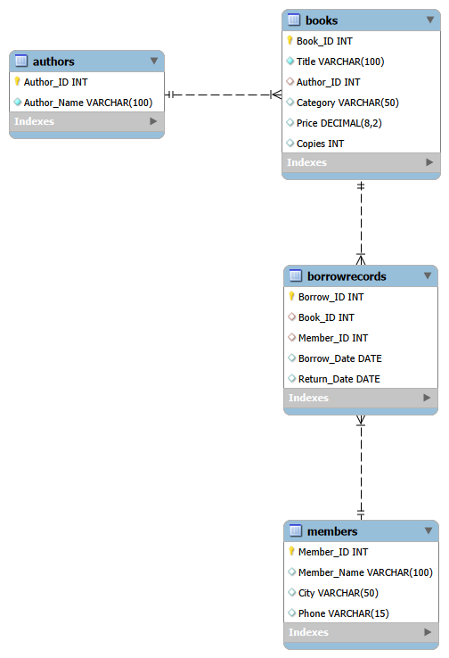

\# 📚 Library Management System using MySQL


A relational database project developed using \*\*MySQL\*\* to manage library operations such as maintaining book records, member information, authors, and borrowing transactions. The project demonstrates database design, SQL querying, reporting, and advanced database programming concepts.


\---


\## 📖 Project Overview


The Library Management System is designed to simulate the operations of a real-world library. It stores information about books, authors, library members, and borrowing records while maintaining relationships between tables using primary and foreign keys.


This project demonstrates both fundamental and advanced SQL concepts that are commonly used in database development and data analysis.


\---


\## 🎯 Objectives


\- Design a normalized relational database.

\- Implement relationships using Primary Keys and Foreign Keys.

\- Perform CRUD operations.

\- Generate business reports using SQL.

\- Demonstrate advanced SQL concepts such as Views, Stored Procedures, Subqueries, CASE statements, and Window Functions.


\---


\## 🛠 Technologies Used


\- MySQL 8.0

\- MySQL Workbench

\- SQL


\---


\## 📂 Project Structure


```

Library-Management-System-SQL/

│

├── README.md

├── LICENSE

├── database\_diagram.png

├── schema.sql

├── sample\_data.sql

├── crud\_operations.sql

├── join\_queries.sql

├── aggregate\_reports.sql

├── advanced\_queries.sql

├── views.sql

├── stored\_procedures.sql

└── screenshots/

```

---

# 🚀 SQL Concepts Demonstrated

This project demonstrates the following SQL concepts:

- Database Creation
- Table Creation
- Primary Keys
- Foreign Keys
- CRUD Operations (Create, Read, Update, Delete)
- INNER JOIN
- Aggregate Functions (`COUNT`, `AVG`)
- `GROUP BY`
- `ORDER BY`
- Subqueries
- CASE Statements
- Window Functions (`DENSE_RANK`)
- Views
- Stored Procedures

---

# 🗄 Database Schema

The database consists of four related tables:

| Table | Description |
|-------|-------------|
| Authors | Stores author information |
| Books | Stores book details including category, price, and copies |
| Members | Stores library member information |
| BorrowRecords | Stores book borrowing transactions |

---

# 🔗 Entity Relationship Diagram (ER Diagram)

The database schema is shown below.


```markdown

```

---

# 📊 Sample Business Queries

This project includes several business-oriented SQL queries, such as:

- Display books with their respective authors.
- Find members who borrowed books written by Dan Brown.
- Count the total number of books by each author.
- Calculate the average price of books by category.
- Identify the most active library members.
- Find books priced above the average book price.
- Rank books by price using Window Functions.

---

# 📸 Project Screenshots

The `screenshots` folder contains images demonstrating the project, including:

- Database tables
- CRUD operations
- JOIN queries
- Aggregate reports
- Advanced SQL queries
- Views
- Stored Procedures

---

# ▶️ How to Run the Project

1. Open MySQL Workbench.
2. Execute `schema.sql` to create the database and tables.
3. Execute `sample_data.sql` to insert sample records.
4. Run the remaining SQL files to explore CRUD operations, reports, views, and stored procedures.
5. View the Entity Relationship Diagram (`database_diagram.png`) for the database structure.

---

# 🔮 Future Improvements

Possible future enhancements include:

- Book reservation system
- Fine calculation for overdue books
- User authentication
- Library staff management
- Dashboard integration with Power BI or Tableau
- Python integration for data analysis

---

# 👩‍💻 Author

**Mary Shalini J**

M.E. Computer Science and Engineering (Big Data Analytics)

---
